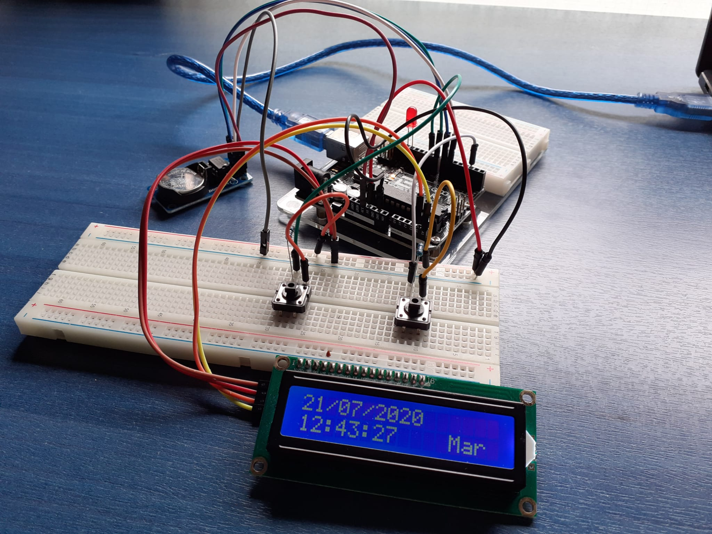

&nbsp;&nbsp;&nbsp;&nbsp;&nbsp;&nbsp;&nbsp;&nbsp;&nbsp;&nbsp;&nbsp;&nbsp;&nbsp;&nbsp;&nbsp;&nbsp;&nbsp;&nbsp;&nbsp;&nbsp;&nbsp;&nbsp;&nbsp;&nbsp;&nbsp;&nbsp;&nbsp;&nbsp;&nbsp;&nbsp;&nbsp;&nbsp;&nbsp;&nbsp;

## Basic Overview

The idea of this project is to create a wrist watch with an arduino board. At the begining the project will be done with the board and other modules. But the idea for a final result is to develop a personalized PCB with all the needed components.

## Chrono 1.1

### description
The first version of Chrono will show the time in a LCD display.
### functionalities
This first version fo chrono shows the time, the date and the day of the week printed on an LCD screen.
### materials
The following list contains the materials to build the 'Chrono1.1'.

- Arduino UNO
- LCD + I2C module
- DS1302 RTC module

The two modules can be bought mounted. However the modules can be mounted by hand having all the needed materials. In that case the materials required will be the following.

- Arduino UNO
- HD4478D (LCD)
- PCF8574 (I2C)
- DS1302 (RTC)
- 10kΩ resistor (x6)
- 330Ω resistor
- 32.768kHz oscillator
- CR2032-BS-2-1 battery holder
- 3V coin cell
### schema
This is the schema of the circuits needed for the first version of the project.

## Chrono 1.2

             

### description
This second version of Chrono, apart from showing us the time we'll be able to time ourselves with the new stopwatch. This would be posible thanks to the two buttons installed in order to interact with the arduino board.
### functionalities
The stopwatch is the new feature in this version of the project, after clicking button1 a stopwatch menu will pop in, and it will start timing. To stop the time button1 should be pressed again. However, if we want to restart the chronometer, we should press button2.
### materials
The following list contains the materials to build the 'Chrono1.2'.

- Arduino UNO
- LCD + I2C module
- DS1302 RTC module
- Button (x2)
- 210Ω resistor(x2)

The two modules can be bought mounted. However the modules can be mounted by hand having all the needed materials. In that case the materials required will be the following.

- Arduino UNO
- HD4478D (LCD)
- PCF8574 (I2C)
- DS1302 (RTC)
- 10kΩ resistor (x6)
- 330Ω resistor
- 32.768kHz oscillator
- CR2032-BS-2-1 battery holder
- 3V coin cell
- Button (x2)
- 210Ω resistor(x2)
### schema
This is the schema of the circuits needed for the first version of the project.

